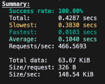

# Compare API for Robyn

This project originated from an article I read on Medium about [Robyn](https://medium.com/pythonistas/meet-robyn-younger-brother-of-the-flask-web-framework-9ffbf02f1fc).

The author mentioned that this emerging Python framework claims to have lower latency than FastAPI.

So, I attempted to set up a `Robyn` project and additionally created `FastAPI` and `Gin` RestAPIs for comparison.

You can view the construction and test scripts of each API and their results within this project.

## Dependencies

- FastAPI
- Robyn
- Go
- Postgres

## Project Structure

After installing dependencies for each Python project:

- `/fast-api` run FastAPI with `fastapi run`
- `/robyn-api` run Robyn with `python -m robyn app.py --dev` for `robyn.env`
- `/gin-api` run gin with `go run .`

## Sample

This project is designed with a simple case: a message feature with viewing permissions.

Users can post messages with permissions set as public, friends-only, or private.

Other users must become friends with the author to view friends-only messages, and viewing history will be recorded.

### Routes

- `/auth/register` - Register user
- `/auth/login` - Login user
- `/messages` - View all messages
- `/messages/auth` - View all messages (Robyn)
- `/message/{message_id}` - View specific message
- `/message/{message_id}/auth` - View specific message (Robyn)
- `/message/create` - Create message
- `/message/{message_id}/delete` - Delete message
- `/history` - View browsing history
  > Routes ending with /auth are because Robyn requires different paths to distinguish whether to use the default auth feature

## Test Case

> Required: [oha](https://github.com/hatoo/oha) for test request

Three types of tests are conducted for each of the 3 frameworks, which you can see in `/test-script/main.py`:

1. Without database: Send request to `/`

2. Simple query: `DELETE /message/{message_id}/delete` simple database command

3. Normal query `POST /message/create` normal database command just create a message object

4. Complex query: `GET /message/{message_id}/auth` includes permission check and record writing, more complex database command

### Results:

with MacBook Pro M2

1. Without database

   > `oha --disable-keepalive http://localhost:8000/`

   - FastAPI

     

   - Robyn

     

   - Gin

     

2. Simple query

   > `oha --disable-keepalive -m DELETE -H "Authorization: Bearer {access_token}" http://localhost:8000/message/{message_id}/delete`

   - FastAPI

     

   - Robyn

     

   - Gin

     

3. Normal query

   > `oha --disable-keepalive -m POST -H "Authorization: Bearer {access_token}" -T application/json -d '{"title": "this title","content": "for body","permission_level": 1}' http://localhost:8000/message/create`

   - FastAPI

     

   - Robyn

     

   - Gin

     

4. Complex query

   > `oha --disable-keepalive -H "Authorization: Bearer {access_token}" http://localhost:8000/message/{message_id}/auth`

   - FastAPI

     

   - Robyn

     

   - Gin

     
