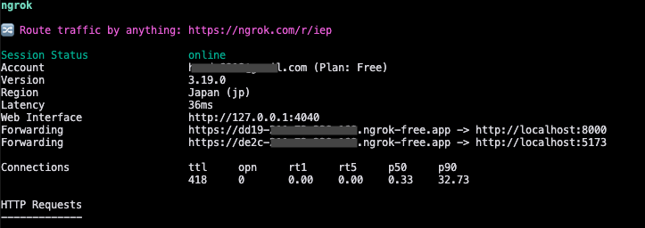
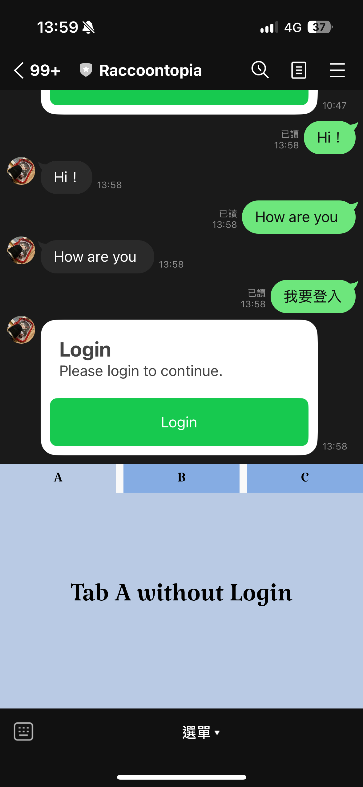
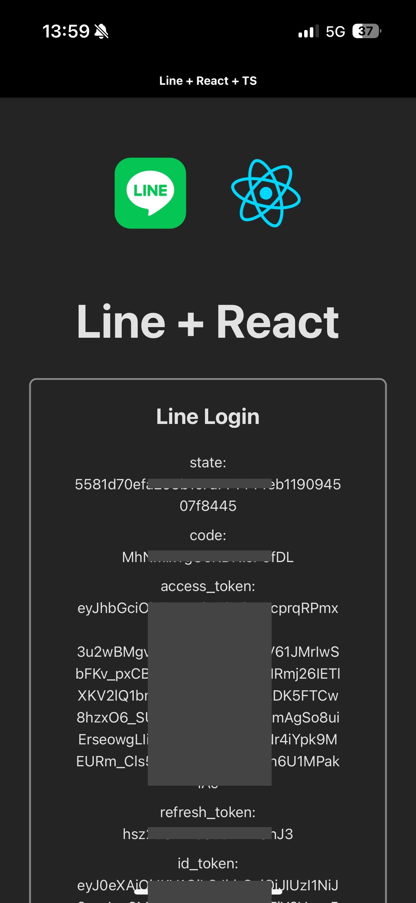
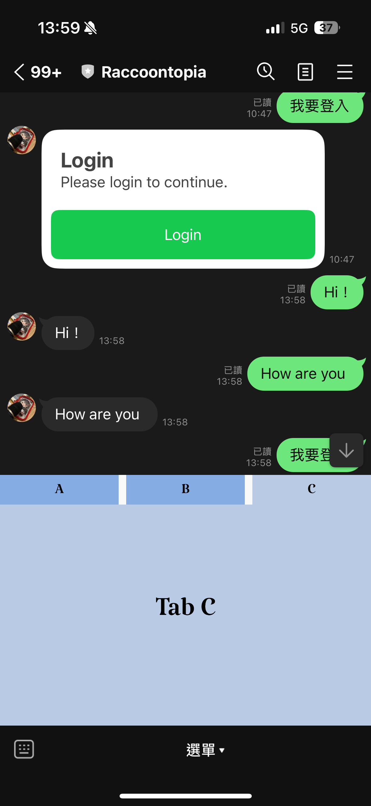
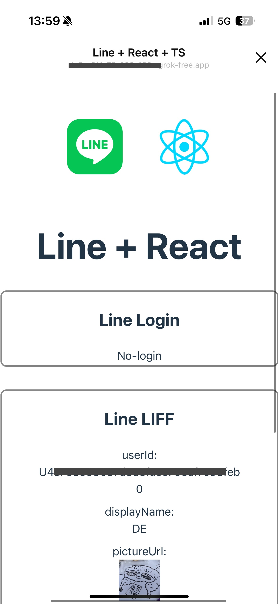
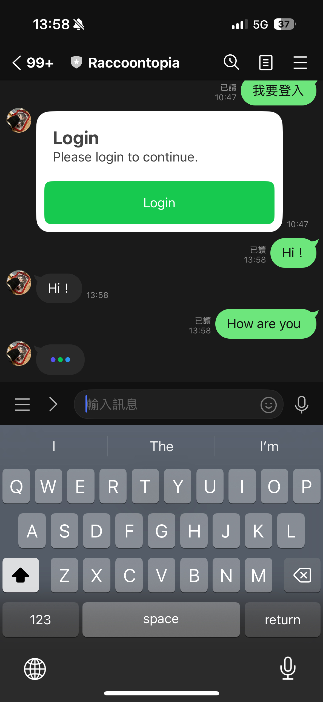

# test-line-bot

This project demonstrates the basic operational functions of LINE Official Account

Including:

- [Message API](https://developers.line.biz/en/reference/messaging-api/#delete-rich-menu)
  - [Flex Message](https://developers.line.biz/en/docs/messaging-api/using-flex-messages/)
  - [Rich Menu](https://developers.line.biz/en/docs/messaging-api/rich-menus-overview/)
- [Login](https://developers.line.biz/en/docs/line-login/integrate-line-login/#get-access-token)
- [LIFF (LINE Front-end Framework)](https://developers.line.biz/en/reference/liff/)

## Prerequisites

Before running the project, you must prepare the following resources:

1. LINE Business Account
2. LINE Develop Providers
   - LINE Message API
   - LINE Login + LINE LIFF
3. (Optional) Ngrok account

   This example uses ngrok to establish service connections, but you can choose to deploy to other service platforms.

4. Environment variables:
   - `.env`
     ```bash
     DATABASE_HOST=
     LINE_MESSAGE_CHANNEL_ID=
     LINE_MESSAGE_CHANNEL_SECRET=
     LINE_MESSAGE_CHANNEL_ACCESS_TOKEN=
     LINE_LOGIN_ID=
     LINE_LOGIN_SECRET=
     LINE_LOGIN_REDIRECT_URI=
     ```
   - `frontend/.env`
     ```bash
     VITE_LIFF_ID=
     VITE_BACKEND_URL=
     ```

## Usage

1. (Optional) Run Ngrok service

   [Configuration](https://ngrok.com/docs/agent/config/v3/#tunnels-deprecated) example:

   ```yaml
   version: "3"
   agent:
   authtoken: YOUR_AUTH_TOKEN
   api_key: YOUR_API_KEY

   endpoints:
   - name: fastapi
       description: use fastapi
       metadata: fastapi
       upstream:
       url: 8000
   - name: vite
       description: use vite
       metadata: vite
       upstream:
       url: 5173

   #(Deprecated)
   # tunnels:
   #   fastapi:
   #     proto: http
   #     addr: 8000
   #   vite:
   #     proto: http
   #     addr: 5173
   ```

   Start service

   ```bash
   ngrok start --all
   ```

   

2. Set frontend Host variables:
   1. Backend `.env`: `LINE_LOGIN_REDIRECT_URI`
   2. LINE Login callback
   3. LINE LIFF callback
3. Set backend Host variables:
   1. Frontend `frontend/.env`: `VITE_BACKEND_URL`
   2. LINE Message API
4. Start backend service
   ```bash
   pip install -r requirements.txt
   fastapi dev
   ```
5. Start frontend service
   ```bash
   cd frontend
   npm install
   npm run dev
   ```
6. Interact through LINE OA's Rich Menu

   1. Tab A: LINE Login

      
      

   2. Tab C: LINE LIFF

      
      

   3. Message: Message API

      
